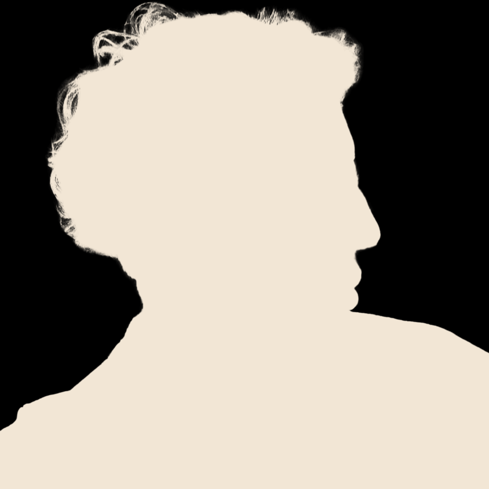
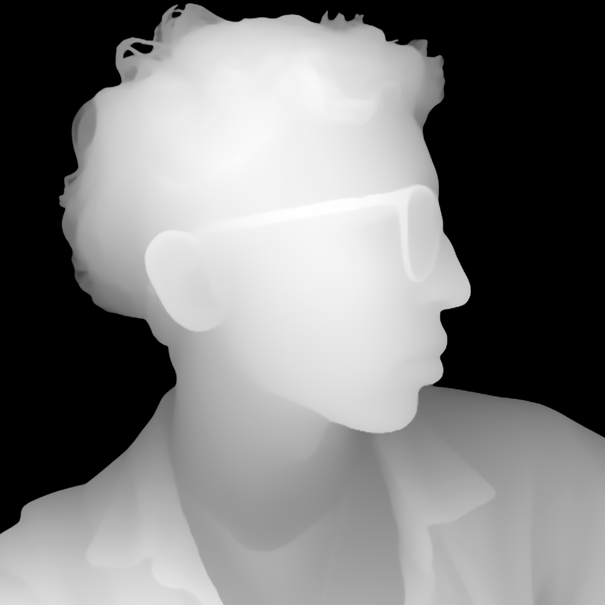
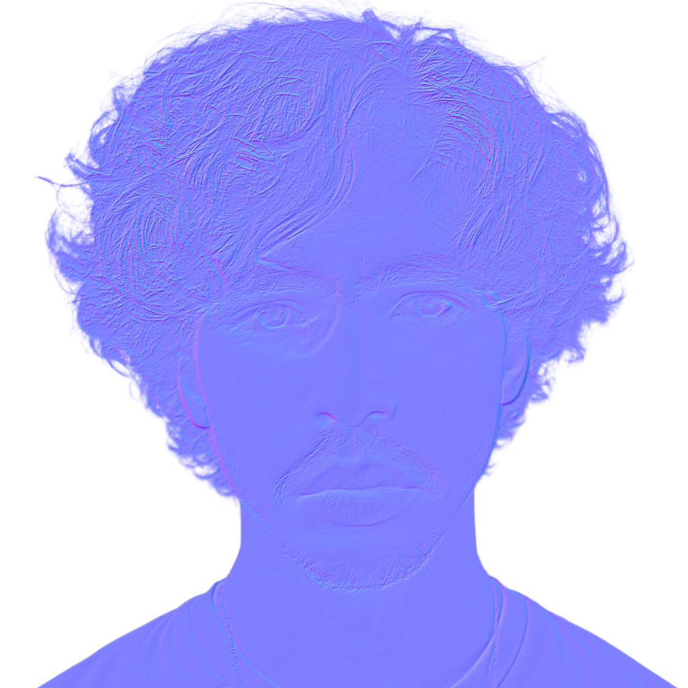
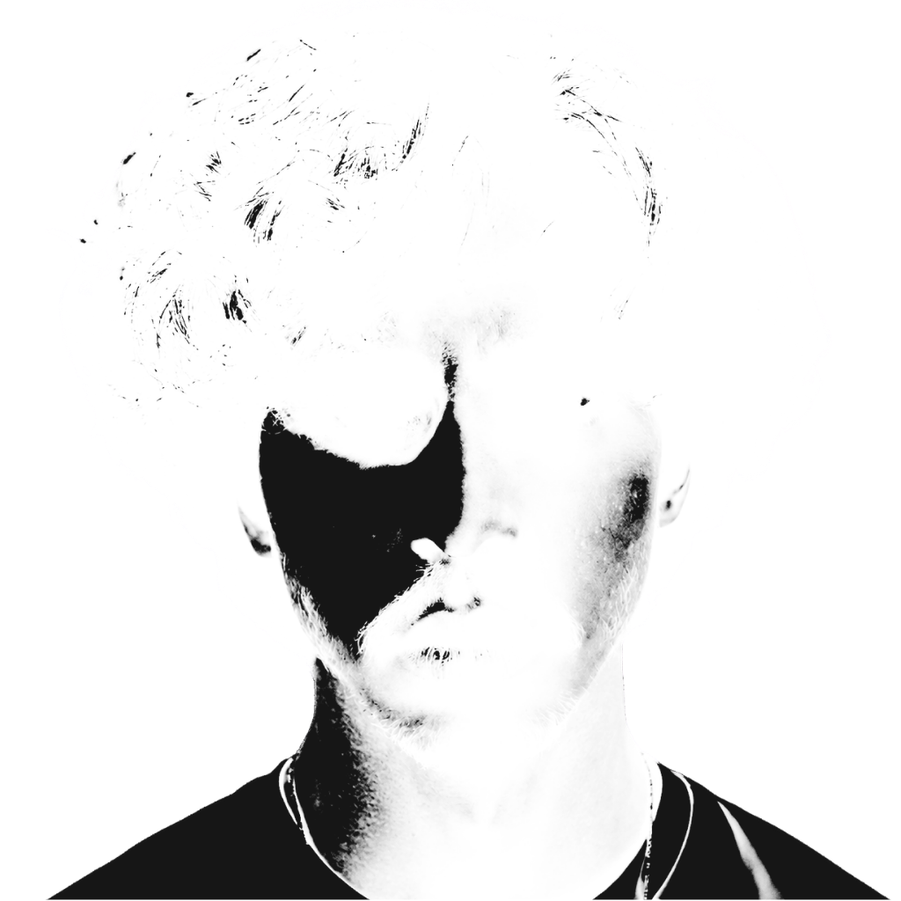

# Preparing Images

Before writing the scene, prepare the image assets. The whole effect depends on a small group of texture maps generated from one portrait.

The current project expects five files:

```txt
public/diffuse.png
public/alpha.png
public/depth.png
public/normal.webp
public/roughness.webp
```

These exact extensions are not required for the effect to work. I use both `.png` and `.webp` to show that multiple image formats can be used. In practice, `.png` and `.webp` are usually good choices for this kind of texture workflow.

The important rule is simple: the filenames and extensions you choose must match the paths you load later in Three.js.

## Start With One Good Photo

Choose a photo that will survive background removal and depth-map generation.

A good source photo usually has:

- A clear subject.
- A removable background.
- Strong separation between subject and background.
- Visible facial and body shape.
- Lighting that does not completely flatten the image.

Avoid very noisy images, low resolution screenshots or photos where the subject blends into the background.

## Create The Diffuse Map

The diffuse map is the visible portrait texture.

<p>
  
</p>

In this project, it is the image you actually see in the scene. My workflow used Canva, but Canva's smart background remover is a premium feature. You can use any background-removal tool that gives you a clean subject with transparency.

For example, Adobe Express has a free online background remover:

- [Adobe Express background remover](https://www.adobe.com/br/express/feature/image/remove-background)

A simple workflow is:

1. Open the photo in your preferred background-removal tool.
2. Remove the background.
3. Export the subject with transparency.
4. Save it as `diffuse.png`.

Place it in `public/diffuse.png`.

<br clear="right" />

## Create The Alpha Map

The alpha map controls the portrait silhouette. White means visible, black means hidden.

<p>
  
</p>

To create it, start from the same background-removed image used for the diffuse map. The goal is to make the subject pure white and the background pure black.

There are many ways to do this:

- Use Canva's duotone or color adjustment tools.
- Use layer blending, masks or fills in Figma.
- Use masks, selections or layer effects in Photoshop.
- Use a free editor like Photopea or GIMP.
- Use any image editor that can turn the subject white and keep the background black.

One practical Canva workflow is:

1. Duplicate the background-removed portrait.
2. Use a duotone or color adjustment effect.
3. Make the subject white.
4. Make the background black.
5. Export it as `alpha.png`.

The shader uses this map to keep the portrait edges clean and transparent.

<br clear="right" />

## Create Depth, Normal And Roughness Maps

The remaining maps help the shader create a stronger illusion:

### Depth Map

<p>
  
</p>

`depth.png` tells the shader which parts feel closer or farther away. In a depth map, brightness usually represents distance information. The exact interpretation depends on the tool and shader, but the important part is that the face, body and background separation are readable.

<br clear="right" />

### Normal Map

<p>
  
</p>

`normal.webp` adds directional surface detail for subtle lighting. It usually has a purple/blue look because the colors represent surface direction rather than visible image color.

<br clear="right" />

### Roughness Map

<p>
  
</p>

`roughness.webp` controls how soft or sharp small highlights feel. For this effect, it does not need to be physically perfect. It just needs to give the shader a useful grayscale guide for subtle light response.

<br clear="right" />

You can generate these maps with free external tools. The exact tool can change over time, so treat these as options, not strict requirements:

- Depth map: [Depth Anything V2 on Hugging Face](https://huggingface.co/spaces/depth-anything/Depth-Anything-V2)
- Normal map: [NormalMap Online](https://normalmaponline.com/#tool)
- Normal map: [NormalMap-Online by Christian Petry](https://cpetry.github.io/NormalMap-Online/)
- Roughness map: [GenPBR](https://genpbr.com/generate)

The important idea is the output: create maps that align with the same portrait framing and export them with the names and formats you plan to load in the scene.

## Asset Checklist

Before continuing, confirm that your chosen files exist. If you follow this project exactly, they will be:

```txt
public/diffuse.png
public/alpha.png
public/depth.png
public/normal.webp
public/roughness.webp
```

If you choose different extensions, update the future texture paths to match them. For example, if you export `normal.png` instead of `normal.webp`, the Three.js texture loader must also point to `normal.png`.

They should all describe the same image, with the same framing and proportions. If one map is cropped differently, the shader will still load it, but the depth and lighting will not line up.

Next: [Building The Scene](building-the-scene.md)
